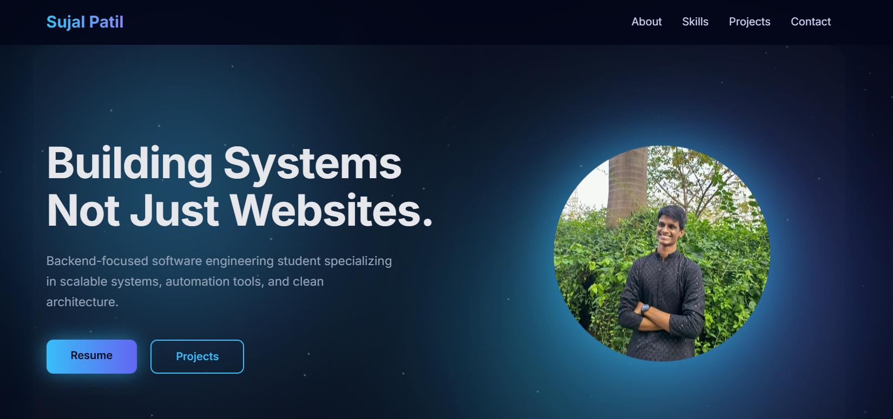

# Portfolio Website

A modern and interactive **personal portfolio website** showcasing my projects, skills, and experience as a backend-focused software engineering student.

This repository emphasizes:
- Clean and responsive UI design  
- Interactive animations and smooth user experience  
- Well-structured HTML, CSS, and JavaScript  
- Professional presentation of projects and skills  

---

## Preview

---

## Objectives
- Build a strong personal brand online  
- Showcase real-world projects and technical skills  
- Provide recruiters with an overview of my profile  
- Maintain a scalable and continuously improving portfolio  

---

## Concepts Covered
- Responsive Web Design  
- HTML5 semantic structure  
- Modern CSS (Flexbox, Grid, Animations)  
- JavaScript DOM manipulation  
- UI/UX fundamentals  
- Performance-friendly animations  
- Accessibility basics  

---

## Repository Structure
- index.html — Main website file  
- css/ — Stylesheets  
- js/ — JavaScript files for interactivity  
- assets/ — Images, icons, and resume  

---

## Intended Use
- Personal portfolio hosting  
- Resume companion website  
- Project showcase  
- Continuous UI/UX experimentation  

---

## Author

Sujal Patil

Email: sujalpatil21@gmail.com  
GitHub: https://github.com/SujalPatil21  
